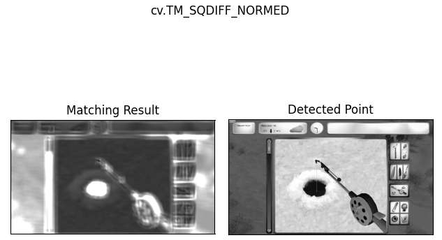
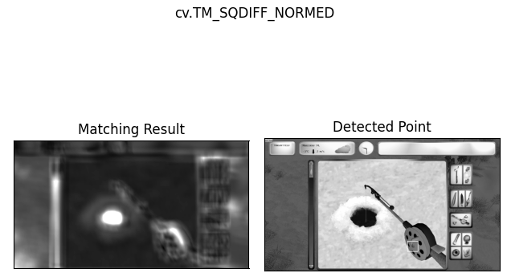

# Pilkki Booster

Boost your Propilkki 2 reaction time. **Useful for DIRTY cheaters like you!** 
Only works with default fishing tool.


Table of contents
=================
* [Process](#process)
* [Troubleshooting](#troubleshooting)


Process
============
1. Window frame must be defined in `Pilkki.py` using `Mouse.py` to get points
    ```python
    from objects import game
    game = game.Game(x=166, y=187, x2=1441, y2=904, strategy=None)
    ```
    * x,y = left top corner
    * x2,y2 = right bottom corner of game screen

2. Run `Pilkki.py` with game open and tool string already in water.
    * Tool must be stable and not have fish biting worm. Otherwise matcher gets wrong points.

3. Feature matcher detects fishing tool tip and adds offset.  
 

4. Handle part is detected which is used to be able to control pulling and random swings.  
 

5. Then `PyAutoGUI` is used to control mouse and pull fishes up automatically.


Troubleshooting
============
* Game and script both needs administrator privileges to control mouse properly.
    * Clicks dont work without permissions.
* There might be some accessibility related permissions required to capture screen.

